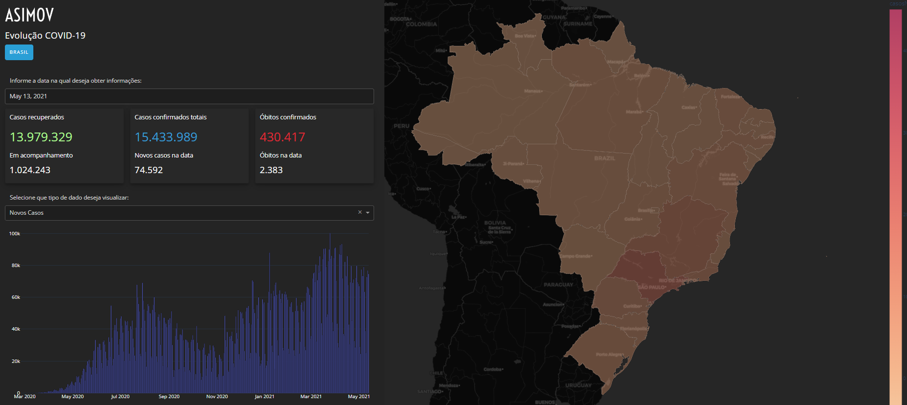

# dashboard-covid-19
Dashboard criado no curso Dashboards Interativos com Python da Asimov Academy, mostrando dados da Covid-19 no Brasil.

Fonte dos dados: <url>https://covid.saude.gov.br/ </url>.

O projeto contempla 3 tipos de visualização:

<ul>
<li>Dados de casos recuperados, confirmados e óbitos, em cards;</li>
<li>Gráficos de casos e óbitos (novos e acumulados) - sendo gráficos de barras ou linha;</li>
<li>Mapa de cores indicando informações relevantes</li>
</ul>

Além disso, existe a possibilidade de filtro de informações por:

<ul>
<li>Data de interesse;</li>
<li>Tipo de dado a visualizar (casos ou óbitos);</li>
<li>Estado do Brasil de interesse</li>
</ul>

O projeto foi feito utilizando-se a ferramenta Dash, seguindo-se a 
documentação e boas práticas (<url>https://dash.plotly.com/ </url>).

